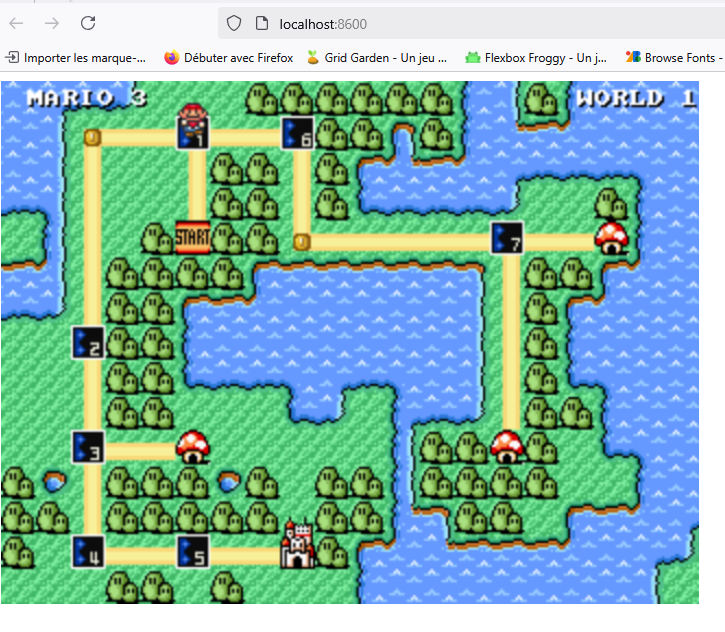

# Jour1_Job03_Docker_DLB
Welcome to Docker - Part 3 // Jouer avec Super Mario
--------------------------------------------
#### **1)** Récupération de l'image “pengbai/supermario” depuis le Docker Desktop :    

Dans la barre de recherche du Desktop, écrire ou coller le nom de l'image à chercher et cliquer sur le bouton "pull" pour la récupérer dans mon Desktop.  

L'image est maintenant présente dans mon Docker Desktop.  

  
  

J'aurais également pu récupérer l'image depuis le Terminal de VSCode avec la commande :  

docker pull pengbai/docker-supermario  
  

#### **2)** Lancer un container avec cette image et lui assigner le port 8600 (en considérant que l’image est configurée sur le port 8080 et en conservant l'accès à l’invite de commande).  

* Etape 1 : Ouvrir VSCode et taper les commandes suivantes dans le Terminal.  

__Commande *pour travailler dans le dossier correspondant à l'exercice*__ :
cd Jour01_Job03_Docker_DLB  

__Commande *pour ouvrir (connecter) mon docker depuis VSCode*__ : 
docker login  

### **3)**  Lancer l'image dans un container. Trouver les deux méthodes **avec des ports différents** pour le faire (invite de commande et ???). 

**Méthode 1 :**  Invite de commande    
Je vais d'abord utiliser l'invite de commande et nommer le container **mario-container**. Je vais le faire fonctionner sur le port 8600:8080.
Je vais ensuite vérifier que le container est activé. 

**Commandes :**    
docker run -d -p8600:8080 --name mario-container pengbai/docker-supermario  

*puis*  
docker ps  

  

**Méthode 2 :** 
Je passe par le Docker Desktop pour effectuer toutes les opérations.

### **4)** Lancer une autre image de super mario sur un port différent, dans un autre container :  

* Ouvrir votre explorateur et trouver le moyen d’accéder au container construit :  

Soit j'ouvre une page dans un navigateur et je tape localhost:8600 (ou l'autre port), soit je passe par le Desktop et je clique directement sur le port rattaché à mon container avec son image et son port.

### **5)** Accéder et jouer un peu dans votre explorateur internet (faites des captures du jeux en cours “3 au moins”)

  
  
  
  
  

### **6)** Retourner dans le terminal de docker desktop pour :

>a) Arrêter votre container par son ID (2 manière de trouver l’ID) :  

> * Depuis le Terminal : docker ps (pour avoir l'id du container) puis docker stop id container (ou nom container).  
> * Depuis le Desktop :  onglet Container, l'ID est mentionné dans une colonne. 

>b) Observer, quand vous avez validé votre commande, ce qui s’est passé dans votre fenêtre au dessus.

Plus de carré vert annonçant le fonctionnement du container dans le Desktop et/ou dans le terminal : docker ps -a (qui liste tous les containers, avec leur statut).

>c) Supprimer le container (2 manières)  

**Méthode 1** : depuis le terminal  

Je liste tous les containers (inactifs) :  
docker ps -a  

docker rm nom du container à supprimer  
[docker rm mario2-container]

*ou*

docker rm id container  
[docker rm e67abcf2e490]

**Méthode 2** : depuis Docker Desktop  
Se positionner sur la ligne du container (dans l'onglet Containers) et cliquer sur la poubelle ou l'onglet "supprimer" qui apparait au-dessus des lignes de containers.  
  

>d) Observer, quand vous avez validé votre commande, ce qui s’est passé dans votre fenêtre au-dessus.  

  

### **7)** Placez vous sur le menu à gauche dans images  

> a) Supprimer l’image docker de super mario (2 manières)  

**Méthode 1** : suppression depuis le Terminal  
Commandes :  
docker rmi nom image 

*ou*  

docker rmi id image

ATTENTION : bien vérifier que TOUS les containers soient arrêtés et supprimés, sinon...  

Une fois tous les containers supprimés :   

  

**Méthode 2** : suppression depuis le Docker Desktop  

>b) Observer, quand vous avez validé votre commande, ce qui s’est passé dans votre fenêtre au-dessus.  

