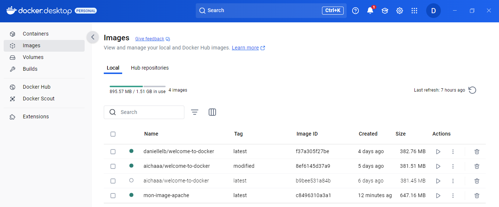
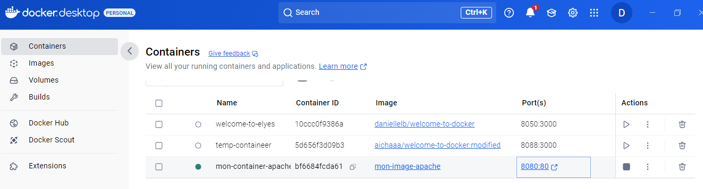

# Jour2_Job04_Docker
Welcome to Docker - Part 4 // Docker Apache - Tout savoir sur le serveur avec phpinfo();  
[ou, comment inclure dans une image docker un serveur apache pour lancer une commande php simple.]
--------------------------------------------
#### **A)** Afficher les informations du serveur lancé dans docker du serveur apache inclus Dans visual studio    

Créer un fichier index.php affichant les info sur le serveur apache (trouver la commande php pour cela, il n'y aura que la balise php et une commande qui ne fait que 10 caractères dans le fichier).  

**1)** Création du fichier ***index.php*** dans mon dossier **Jour02_Job04_Docker_DLB**  
  

**2)** Création du fichier Dockerfile, rattaché à la racine de l'arborescence "Jour02...".  
Ce dockerfile doit générer un environnement apache pour afficher cette page. On trouvera donc dedans :    

> => Application sur le port 80  

> => Exposer sur le port 8080  

> => le serveur phpinfo();  

  

**3)** Créer l’image et le container 

> L'image  
docker build -t apache .  
  

  

> Le container  
docker run -d -p 8080:80 --name mon-serveur-apache apache  

  

  

**4)** Faites tourner le container  
Ouvrir le localhost 8080  

**5)** Stopper le container  
