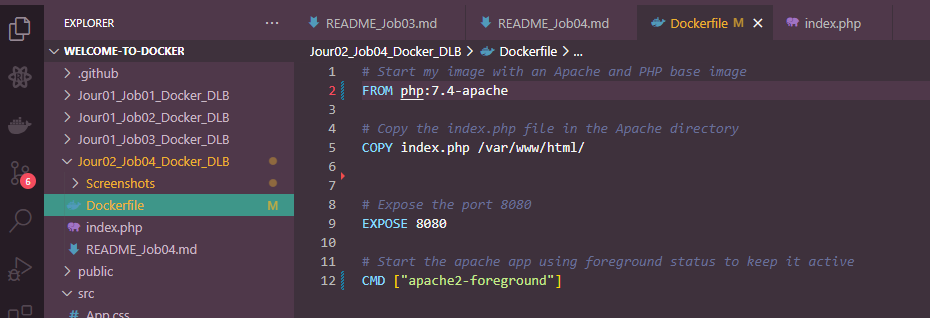
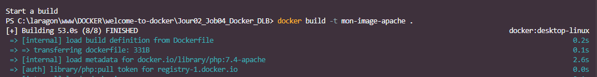
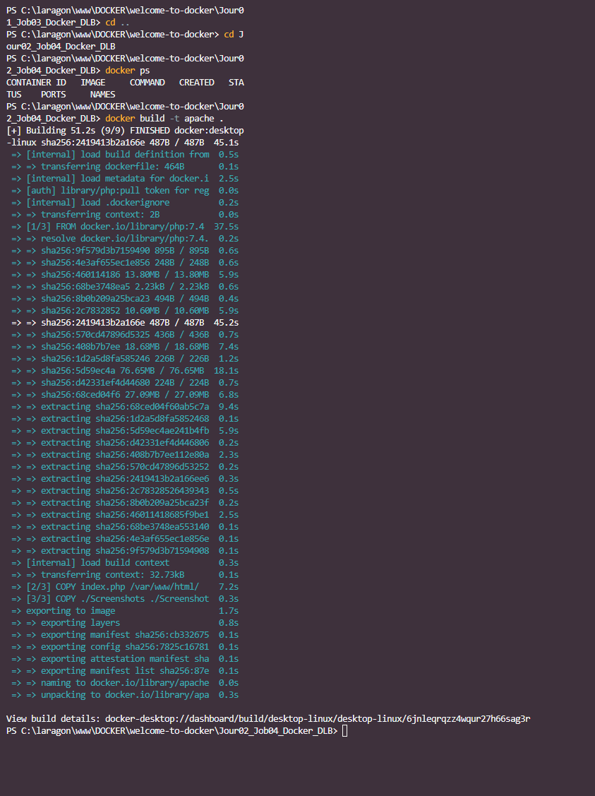
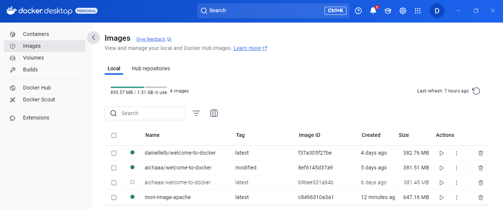
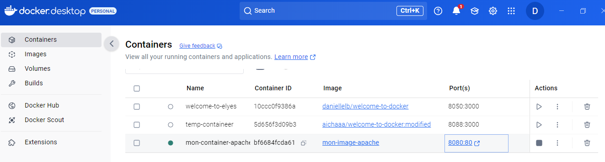
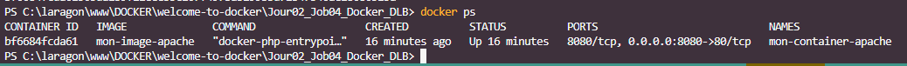
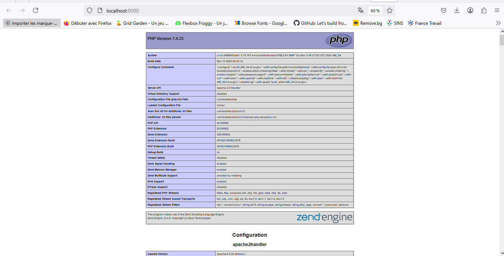
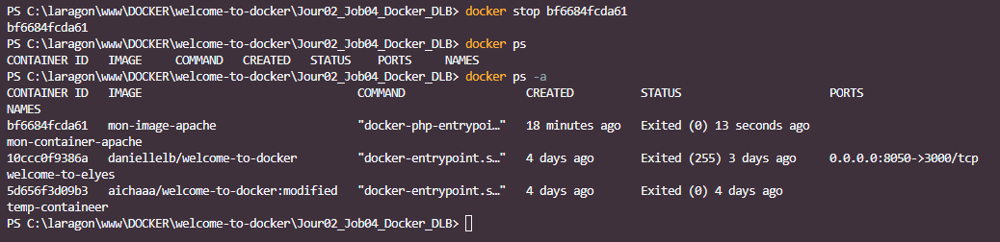

# Jour3_Job05_Docker
Welcome to Docker - Part 5 // Tic Tac Toe  

--------------------------------------------
#### **A)** Docker et volume  

Création d'une image Docker et d'un volume pour sauvegarder les résultats d’un jeu de morpion et les rendre persistants.    

-----------

Configurer un projet Docker pour une application web.
● Vous êtes chargé d’héberger un petit jeu web, Tic Tac Toe (Morpion), en utilisant Docker.
● Créer les fichiers fournis en annexes à la fin du document
○ Index.html
○ save.php
○ results.json
● Créer le fichier Dockerfile et le rédiger.
● Construire une image Docker pour servir les fichiers du jeu.
● Créer un volume nommé “game-results” pour stocker les
résultats dans un fichier resuslts.json et le fichier save.php 
(C’est Dockerfile qui les copiera dedans)

● Exécuter le conteneur pour rendre le jeu accessible via un navigateur sur le port 8080 .
● Envoyer les résultats disponibles dans le volume et dans
results.json
● Utilisez une image Docker basée sur Nginx pour servir les fichiers.
● Le fichier index.html doit être copié dans le conteneur.

_3

○ (Cette page html est capable de tourner sans docker
mais l’objectif n’est pas une question de code, ni de
coder quoi que ce soit.

● exposer le port 80
● accessible sur le port 8080
● Trouver la commande Docker qui permet de vérifier que la
création du volume est effective
● faire en sorte que le volume soit lié au container et vérifier
que les résultats s’enregistre bien dans le volume dans
results.json par le biais du fichier save.php se trouvant aussi
dans le volume
● Trouver la commande qui affiche le contenu du container
● Trouver la commande qui affiche le contenu du volume
● Trouver comment faire ces deux actions dans
docker-desktop et le terminal
● Afficher le contenu de results.json avec une commande et
avec docker-desktop et dans le terminal
● Jouer au morpion pendant plusieurs parties pour générer des
résultats
● Les résultat seront visible dans un fichier results dans le
volume
● stopper le container

_4

● Afficher dans le readme une capture du résultat des parties
du jeu (contenu du fichier “result.json”)

-----------

**1)** Création du fichier ***index.php*** dans mon dossier **Jour02_Job04_Docker_DLB**  
  

**2)** Création du fichier Dockerfile, rattaché à la racine de l'arborescence "Jour02...".  
Ce dockerfile doit générer un environnement apache pour afficher cette page. On trouvera donc dedans :    

> => Application sur le port 80  

> => Exposer sur le port 8080  

> => le serveur phpinfo();  

  

**3)** Créer l’image et le container 

> L'image  
docker build -t apache .  
  

  

  

> Le container  
docker run -d -p 8080:80 --name mon-container-apache mon-image-apache  

  

  

**4)** Faites tourner le container  
Ouvrir le localhost 8080  
  

**5)** Stopper le container  
docker stop <id container> (ou nom container)  

  

